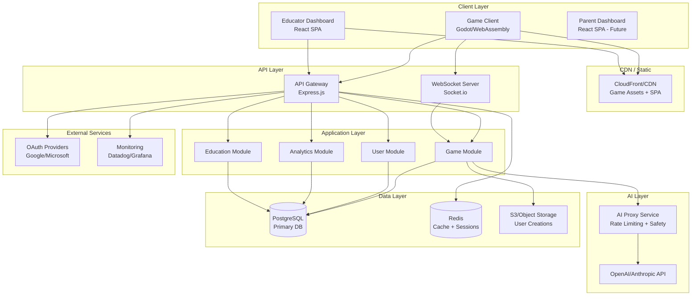
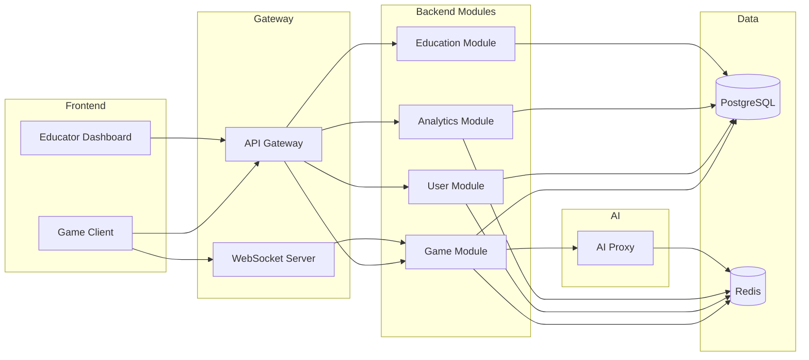
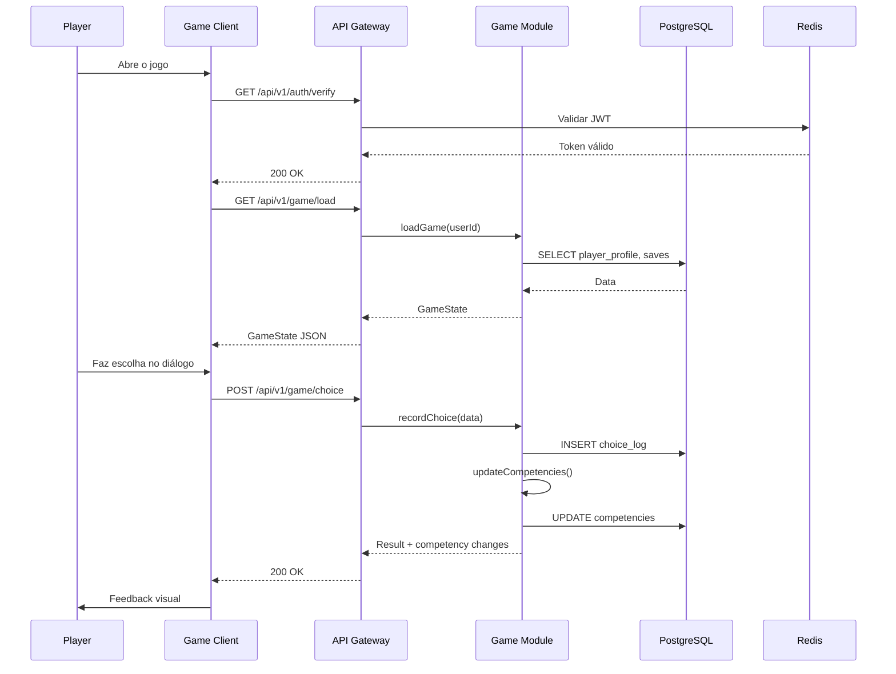
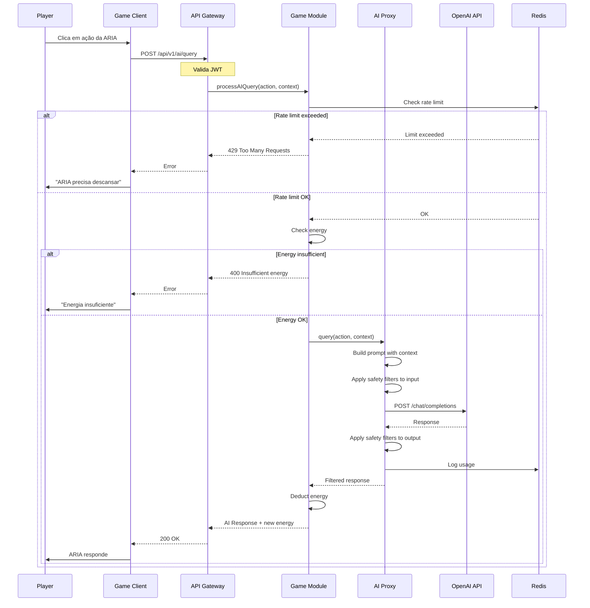
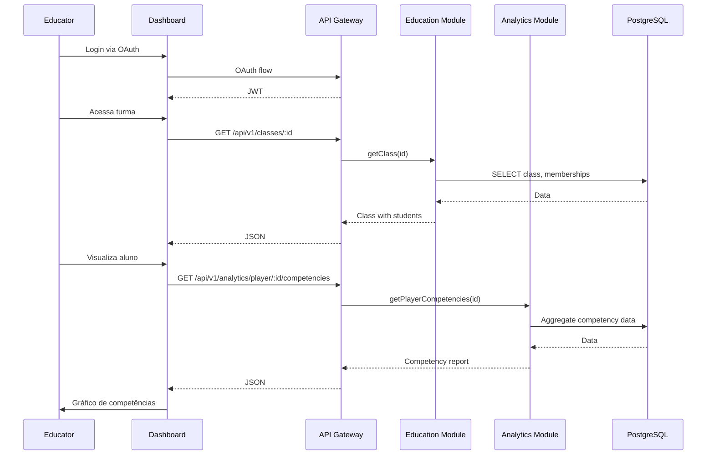

# IAção - Architecture Document

> **Versão:** 1.0
> **Data:** 2025-12-27
> **Status:** Draft

---

## 1. Introduction

Este documento descreve a arquitetura técnica completa do **IAção**, um RPG educacional que integra IA como recurso estratégico. O objetivo é servir como blueprint para desenvolvimento, garantindo consistência e aderência aos padrões escolhidos.

**Relationship to Frontend Architecture:**
O game client (Godot) e o educator dashboard (React) terão especificações de UI detalhadas em documento separado (Front-End Spec). As escolhas de tech stack aqui são definitivas para todo o projeto.

### Starter Template

**N/A** - Este é um projeto greenfield. O game client usará Godot 4.x com estrutura padrão, e o backend será construído do zero com Node.js/TypeScript seguindo boas práticas de API design.

### Change Log

| Date | Version | Description | Author |
|------|---------|-------------|--------|
| 2025-12-27 | 1.0 | Initial architecture document | BMad Architect |

---

## 2. High Level Architecture

### 2.1 Technical Summary

O IAção utiliza uma arquitetura **híbrida monolith modular + serviço de IA dedicado**. O game client é desenvolvido em Godot 4 e exportado para WebAssembly, comunicando-se com um backend Node.js/TypeScript via REST e WebSocket. O sistema de IA é isolado em um serviço próprio para controle de custos, segurança e rate limiting. PostgreSQL serve como banco principal, com Redis para cache e sessões. O educator dashboard é uma SPA React separada que consome a mesma API.

Esta arquitetura foi escolhida para:
- **Simplicidade:** Monolith modular é mais fácil de desenvolver e debugar para equipe pequena
- **Segurança:** Serviço de IA isolado permite controle granular de acesso e custos
- **Performance:** WebAssembly + CDN garante carregamento rápido do game
- **Escalabilidade futura:** Pode evoluir para microserviços se necessário

### 2.2 High Level Overview

**Architectural Style:** Monolith Modular com Serviço de IA Separado

**Repository Structure:** Monorepo com workspaces (npm/yarn)

**Service Architecture:**
- **Game Client:** Godot 4.x exportado para HTML5/WebAssembly
- **API Gateway:** Express.js com autenticação e rate limiting
- **Core API:** Node.js/TypeScript com módulos para Game, User, Analytics
- **AI Proxy Service:** Serviço dedicado para integração com LLM
- **Educator Dashboard:** React SPA
- **Database Layer:** PostgreSQL + Redis

**Primary Data Flow:**
1. Jogador acessa game via browser (CDN serve assets estáticos)
2. Game client autentica via OAuth e obtém JWT
3. Ações do jogo são enviadas ao backend via REST/WebSocket
4. Uso de IA passa pelo AI Proxy Service com rate limiting
5. Dados persistem no PostgreSQL, sessões no Redis
6. Educadores acessam dashboard separado com mesma API

### 2.3 High Level Project Diagram



### 2.4 Architectural and Design Patterns

| Pattern | Description | Rationale |
|---------|-------------|-----------|
| **Modular Monolith** | Backend organizado em módulos com boundaries claros | Simplicidade para MVP, fácil refatoração futura para microserviços |
| **Repository Pattern** | Abstração de acesso a dados | Facilita testes e permite trocar ORM se necessário |
| **CQRS Lite** | Separação de leitura/escrita para analytics | Performance em queries de dashboard sem overhead de event sourcing |
| **Proxy Pattern (AI)** | Serviço intermediário para chamadas de IA | Controle de custos, segurança, caching, rate limiting |
| **Event-Driven (interno)** | Eventos para comunicação entre módulos | Desacoplamento, facilita analytics e auditoria |
| **JWT + Refresh Token** | Autenticação stateless com renovação | Segurança + escalabilidade |
| **Circuit Breaker** | Proteção para chamadas externas (IA, OAuth) | Resiliência quando serviços externos falham |

---

## 3. Tech Stack

### 3.1 Cloud Infrastructure

- **Provider:** AWS (primário) ou GCP (alternativa)
- **Key Services:**
  - Compute: ECS Fargate ou Cloud Run
  - Database: RDS PostgreSQL ou Cloud SQL
  - Cache: ElastiCache Redis ou Memorystore
  - Storage: S3 ou Cloud Storage
  - CDN: CloudFront ou Cloud CDN
  - Secrets: Secrets Manager ou Secret Manager
- **Deployment Regions:** sa-east-1 (São Paulo) primário

### 3.2 Technology Stack Table

| Category | Technology | Version | Purpose | Rationale |
|----------|------------|---------|---------|-----------|
| **Game Engine** | Godot | 4.2.x | Game client development | Open source, WebAssembly export nativo, GDScript acessível |
| **Game Language** | GDScript | 4.2 | Game logic | Sintaxe Python-like, integração nativa com Godot |
| **Backend Runtime** | Node.js | 20.x LTS | API server | LTS estável, amplo ecossistema, async I/O |
| **Backend Language** | TypeScript | 5.3.x | Type-safe backend | Tipagem forte, melhor DX, menos bugs |
| **API Framework** | Express.js | 4.18.x | HTTP server | Maduro, simples, extensível |
| **WebSocket** | Socket.io | 4.7.x | Real-time communication | Fallback automático, rooms, reconexão |
| **Validation** | Zod | 3.22.x | Schema validation | TypeScript-first, runtime validation |
| **ORM** | Prisma | 5.x | Database access | Type-safe queries, migrations, excelente DX |
| **Database** | PostgreSQL | 15.x | Primary database | Robusto, JSONB, extensões (pgvector futuro) |
| **Cache** | Redis | 7.x | Session + cache | Rápido, rate limiting, pub/sub |
| **Dashboard Framework** | React | 18.x | Educator dashboard | Ecossistema maduro, componentes ricos |
| **Dashboard Build** | Vite | 5.x | Frontend tooling | Rápido, ESM nativo, HMR |
| **Dashboard UI** | Tailwind CSS | 3.4.x | Styling | Utility-first, design system fácil |
| **Dashboard Charts** | Recharts | 2.x | Data visualization | React-nativo, customizável |
| **Auth** | Passport.js | 0.7.x | OAuth implementation | Strategies para Google/Microsoft |
| **JWT** | jose | 5.x | Token handling | Seguro, standards-compliant |
| **AI Provider** | OpenAI | API v1 | LLM integration | GPT-4o-mini para custo-benefício |
| **AI Fallback** | Anthropic | API v1 | LLM backup | Claude Haiku como alternativa |
| **Testing** | Vitest | 1.x | Unit testing | Rápido, compatível com Jest API |
| **E2E Testing** | Playwright | 1.40.x | Dashboard E2E | Cross-browser, reliable |
| **Game Testing** | GDUnit4 | 4.x | Godot unit tests | Framework de testes para Godot |
| **Logging** | Pino | 8.x | Structured logging | Rápido, JSON nativo |
| **Monitoring** | Datadog | SaaS | APM + logs | Completo, fácil setup |
| **IaC** | Terraform | 1.6.x | Infrastructure | Multi-cloud, state management |
| **CI/CD** | GitHub Actions | N/A | Automation | Integrado com repo, gratuito |
| **Container** | Docker | 24.x | Containerization | Standard, multi-stage builds |

---

## 4. Data Models

### 4.1 User

**Purpose:** Representa qualquer usuário do sistema (jogador, educador, responsável)

**Key Attributes:**
- `id`: UUID - Identificador único
- `email`: String - Email para login
- `name`: String - Nome de exibição
- `role`: Enum (player, educator, parent) - Tipo de usuário
- `avatar_url`: String? - URL do avatar
- `oauth_provider`: String - Google/Microsoft
- `oauth_id`: String - ID no provider
- `created_at`: DateTime - Data de criação
- `last_login`: DateTime - Último acesso

**Relationships:**
- User 1:1 PlayerProfile (se role=player)
- User 1:N ClassMembership (educador ou aluno)
- User 1:N ParentChild (responsável)

---

### 4.2 PlayerProfile

**Purpose:** Dados específicos do jogador no game

**Key Attributes:**
- `id`: UUID - Identificador
- `user_id`: UUID - FK para User
- `character_name`: String - Nome do personagem
- `character_appearance`: JSON - Customização visual
- `background`: Enum - Origem escolhida (inventor, artist, mediator, explorer)
- `current_region`: String - Região atual no jogo
- `energy`: Int (0-100) - Energia para usar IA
- `play_time_minutes`: Int - Tempo total de jogo
- `created_at`: DateTime
- `updated_at`: DateTime

**Relationships:**
- PlayerProfile N:1 User
- PlayerProfile 1:N GameSave
- PlayerProfile 1:N Competency
- PlayerProfile 1:N MissionProgress
- PlayerProfile 1:N Creation
- PlayerProfile 1:N ChoiceLog
- PlayerProfile 1:N AIUsageLog

---

### 4.3 Competency

**Purpose:** Níveis de competência do jogador

**Key Attributes:**
- `id`: UUID
- `player_id`: UUID - FK para PlayerProfile
- `type`: Enum - (creativity, critical_thinking, communication, logic, digital_ethics, collaboration)
- `level`: Int (0-100) - Nível atual
- `updated_at`: DateTime

**Relationships:**
- Competency N:1 PlayerProfile
- Competency 1:N CompetencyHistory (log de mudanças)

---

### 4.4 Mission

**Purpose:** Definição de uma missão do jogo

**Key Attributes:**
- `id`: String - Identificador único (e.g., "c1_m1_festa")
- `cycle`: Int - Ciclo do jogo (1-5)
- `title`: String - Título da missão
- `description`: Text - Descrição
- `objectives`: JSON - Lista de objetivos
- `prerequisites`: JSON - Missões/flags necessárias
- `rewards`: JSON - Competências e itens ganhos
- `branches`: JSON - Caminhos alternativos

**Relationships:**
- Mission 1:N MissionProgress

---

### 4.5 MissionProgress

**Purpose:** Progresso do jogador em uma missão

**Key Attributes:**
- `id`: UUID
- `player_id`: UUID - FK para PlayerProfile
- `mission_id`: String - FK para Mission
- `status`: Enum (not_started, in_progress, completed)
- `objectives_completed`: JSON - Status de cada objetivo
- `chosen_branch`: String? - Caminho escolhido
- `started_at`: DateTime?
- `completed_at`: DateTime?

**Relationships:**
- MissionProgress N:1 PlayerProfile
- MissionProgress N:1 Mission

---

### 4.6 ChoiceLog

**Purpose:** Registro de escolhas do jogador para análise

**Key Attributes:**
- `id`: UUID
- `player_id`: UUID
- `mission_id`: String?
- `dialogue_id`: String - ID do diálogo
- `choice_id`: String - ID da escolha
- `choice_text`: String - Texto escolhido
- `context`: JSON - Contexto adicional
- `competencies_affected`: JSON - Impacto em competências
- `created_at`: DateTime

**Relationships:**
- ChoiceLog N:1 PlayerProfile

---

### 4.7 Creation

**Purpose:** Projetos/ideias criados pelo jogador

**Key Attributes:**
- `id`: UUID
- `player_id`: UUID
- `mission_id`: String? - Missão associada
- `title`: String
- `content`: Text - Conteúdo da criação
- `type`: Enum (idea, project, pitch)
- `evaluation`: JSON? - Avaliação da IA
- `score`: Int? (1-5) - Score médio
- `submitted_at`: DateTime?
- `created_at`: DateTime
- `updated_at`: DateTime

**Relationships:**
- Creation N:1 PlayerProfile
- Creation N:1 Mission (opcional)

---

### 4.8 AIUsageLog

**Purpose:** Log de uso de IA para análise e billing

**Key Attributes:**
- `id`: UUID
- `player_id`: UUID
- `action`: Enum (analyze, suggest, simulate, improve)
- `energy_cost`: Int
- `context`: JSON - Contexto enviado
- `prompt_tokens`: Int
- `completion_tokens`: Int
- `response_filtered`: Boolean - Se filtro ativou
- `latency_ms`: Int
- `created_at`: DateTime

**Relationships:**
- AIUsageLog N:1 PlayerProfile

---

### 4.9 Class

**Purpose:** Turma de alunos gerenciada por educador

**Key Attributes:**
- `id`: UUID
- `name`: String
- `educator_id`: UUID - FK para User
- `invite_code`: String - Código para entrar
- `max_students`: Int
- `is_archived`: Boolean
- `created_at`: DateTime

**Relationships:**
- Class N:1 User (educator)
- Class 1:N ClassMembership

---

### 4.10 ClassMembership

**Purpose:** Associação aluno-turma

**Key Attributes:**
- `id`: UUID
- `class_id`: UUID
- `user_id`: UUID
- `joined_at`: DateTime

**Relationships:**
- ClassMembership N:1 Class
- ClassMembership N:1 User

---

## 5. Components

### 5.1 Game Client (Godot)

**Responsibility:** Renderização do jogo, input handling, comunicação com backend

**Key Interfaces:**
- HTTP Client para REST API
- WebSocket Client para eventos real-time
- Local Storage para cache de assets

**Dependencies:** API Gateway, CDN

**Technology Stack:**
- Godot 4.2.x
- GDScript
- HTTPRequest node
- WebSocketPeer

---

### 5.2 API Gateway

**Responsibility:** Entry point para todas as requisições, autenticação, rate limiting

**Key Interfaces:**
- REST endpoints (/api/v1/*)
- WebSocket upgrade (/ws)
- Health check (/health)

**Dependencies:** Game Module, User Module, Analytics Module, Education Module, Redis

**Technology Stack:**
- Express.js 4.18.x
- Passport.js (OAuth)
- express-rate-limit
- helmet (security headers)
- cors

---

### 5.3 Game Module

**Responsibility:** Lógica de jogo, missões, progressão, integração com IA

**Key Interfaces:**
- `POST /api/v1/game/save` - Salvar progresso
- `GET /api/v1/game/load` - Carregar save
- `POST /api/v1/game/choice` - Registrar escolha
- `POST /api/v1/game/mission/complete` - Completar missão
- `POST /api/v1/ai/query` - Consultar ARIA

**Dependencies:** AI Proxy Service, PostgreSQL, Redis

**Technology Stack:**
- TypeScript
- Prisma (ORM)
- Event emitter para módulos internos

---

### 5.4 User Module

**Responsibility:** Autenticação, perfis, preferências

**Key Interfaces:**
- `POST /api/v1/auth/oauth/:provider` - Login OAuth
- `POST /api/v1/auth/refresh` - Refresh token
- `GET /api/v1/users/me` - Perfil atual
- `PATCH /api/v1/users/me` - Atualizar perfil

**Dependencies:** PostgreSQL, Redis, OAuth Providers

**Technology Stack:**
- TypeScript
- Passport.js
- jose (JWT)
- bcrypt

---

### 5.5 Analytics Module

**Responsibility:** Coleta e agregação de dados para dashboards

**Key Interfaces:**
- `GET /api/v1/analytics/player/:id/competencies`
- `GET /api/v1/analytics/player/:id/activity`
- `GET /api/v1/analytics/class/:id/summary`

**Dependencies:** PostgreSQL (read replicas recomendado para produção)

**Technology Stack:**
- TypeScript
- Prisma com raw queries para agregações
- Cache em Redis

---

### 5.6 Education Module

**Responsibility:** Gestão de turmas, relatórios, funcionalidades para educadores

**Key Interfaces:**
- `POST /api/v1/classes` - Criar turma
- `GET /api/v1/classes/:id/students` - Listar alunos
- `GET /api/v1/reports/:type` - Gerar relatório

**Dependencies:** PostgreSQL, Analytics Module

**Technology Stack:**
- TypeScript
- PDFKit ou Puppeteer para geração de PDF

---

### 5.7 AI Proxy Service

**Responsibility:** Intermediar chamadas de IA, aplicar rate limiting, filtros de segurança

**Key Interfaces:**
- `POST /ai/query` - Processar query com contexto
- `GET /ai/health` - Health check

**Dependencies:** OpenAI API, Anthropic API (fallback), Redis

**Technology Stack:**
- TypeScript
- axios para chamadas HTTP
- ioredis para rate limiting
- Bad words filter + custom blocklist

---

### 5.8 Educator Dashboard

**Responsibility:** Interface web para educadores gerenciarem turmas e visualizarem progresso

**Key Interfaces:**
- SPA React consumindo API Gateway

**Dependencies:** API Gateway

**Technology Stack:**
- React 18.x
- Vite
- React Router
- TanStack Query
- Recharts
- Tailwind CSS

---

### 5.9 Component Diagram



---

## 6. External APIs

### 6.1 OpenAI API

- **Purpose:** LLM para ARIA (IA mentora do jogo)
- **Documentation:** https://platform.openai.com/docs/api-reference
- **Base URL:** https://api.openai.com/v1
- **Authentication:** Bearer token (API Key)
- **Rate Limits:** Tier-based, ~10k tokens/min inicial

**Key Endpoints Used:**
- `POST /chat/completions` - Gerar resposta de ARIA

**Integration Notes:**
- Usar gpt-4o-mini para custo-benefício
- System prompt define personalidade ARIA
- Max tokens limitado para controlar custos
- Timeout de 10s com retry
- Fallback para Anthropic se falhar

---

### 6.2 Anthropic API (Fallback)

- **Purpose:** LLM backup caso OpenAI falhe
- **Documentation:** https://docs.anthropic.com/claude/reference
- **Base URL:** https://api.anthropic.com/v1
- **Authentication:** x-api-key header
- **Rate Limits:** Tier-based

**Key Endpoints Used:**
- `POST /messages` - Gerar resposta de ARIA

**Integration Notes:**
- Usar claude-3-haiku para custo
- Prompt adaptado para formato Anthropic
- Ativado apenas quando OpenAI falha após retries

---

### 6.3 Google OAuth

- **Purpose:** Login com conta Google
- **Documentation:** https://developers.google.com/identity/protocols/oauth2
- **Base URL:** https://accounts.google.com
- **Authentication:** OAuth 2.0 flow

**Key Endpoints Used:**
- `GET /o/oauth2/v2/auth` - Iniciar flow
- `POST /token` - Trocar code por tokens
- `GET /oauth2/v2/userinfo` - Obter dados do usuário

---

### 6.4 Microsoft OAuth

- **Purpose:** Login com conta Microsoft (escolas)
- **Documentation:** https://docs.microsoft.com/azure/active-directory/develop
- **Base URL:** https://login.microsoftonline.com
- **Authentication:** OAuth 2.0 flow

**Key Endpoints Used:**
- `GET /{tenant}/oauth2/v2.0/authorize` - Iniciar flow
- `POST /{tenant}/oauth2/v2.0/token` - Trocar code por tokens
- `GET /me` (Graph API) - Obter dados do usuário

---

## 7. Core Workflows

### 7.1 Game Session Flow



### 7.2 AI Query Flow



### 7.3 Educator Dashboard Flow



---

## 8. REST API Spec

```yaml
openapi: 3.0.0
info:
  title: IAção API
  version: 1.0.0
  description: API para o game educacional IAção

servers:
  - url: https://api.iacao.com.br/v1
    description: Production
  - url: http://localhost:3000/v1
    description: Development

components:
  securitySchemes:
    bearerAuth:
      type: http
      scheme: bearer
      bearerFormat: JWT

  schemas:
    Error:
      type: object
      properties:
        code:
          type: string
        message:
          type: string

    User:
      type: object
      properties:
        id:
          type: string
          format: uuid
        email:
          type: string
        name:
          type: string
        role:
          type: string
          enum: [player, educator, parent]

    PlayerProfile:
      type: object
      properties:
        id:
          type: string
          format: uuid
        characterName:
          type: string
        background:
          type: string
        energy:
          type: integer
        competencies:
          type: array
          items:
            $ref: '#/components/schemas/Competency'

    Competency:
      type: object
      properties:
        type:
          type: string
          enum: [creativity, critical_thinking, communication, logic, digital_ethics, collaboration]
        level:
          type: integer
          minimum: 0
          maximum: 100

    GameState:
      type: object
      properties:
        profile:
          $ref: '#/components/schemas/PlayerProfile'
        currentRegion:
          type: string
        worldFlags:
          type: object
        activeMissions:
          type: array
          items:
            type: object

    AIQuery:
      type: object
      required:
        - action
      properties:
        action:
          type: string
          enum: [analyze, suggest, simulate, improve]
        context:
          type: string
        missionId:
          type: string

    AIResponse:
      type: object
      properties:
        response:
          type: string
        energyCost:
          type: integer
        newEnergy:
          type: integer

paths:
  /auth/oauth/{provider}:
    get:
      summary: Initiate OAuth flow
      parameters:
        - name: provider
          in: path
          required: true
          schema:
            type: string
            enum: [google, microsoft]
      responses:
        '302':
          description: Redirect to OAuth provider

  /auth/callback/{provider}:
    get:
      summary: OAuth callback
      parameters:
        - name: provider
          in: path
          required: true
          schema:
            type: string
      responses:
        '200':
          description: JWT tokens returned

  /auth/refresh:
    post:
      summary: Refresh access token
      responses:
        '200':
          description: New tokens

  /users/me:
    get:
      summary: Get current user
      security:
        - bearerAuth: []
      responses:
        '200':
          description: User profile
          content:
            application/json:
              schema:
                $ref: '#/components/schemas/User'

  /game/load:
    get:
      summary: Load game state
      security:
        - bearerAuth: []
      responses:
        '200':
          description: Game state loaded
          content:
            application/json:
              schema:
                $ref: '#/components/schemas/GameState'

  /game/save:
    post:
      summary: Save game state
      security:
        - bearerAuth: []
      requestBody:
        required: true
        content:
          application/json:
            schema:
              $ref: '#/components/schemas/GameState'
      responses:
        '200':
          description: Game saved

  /game/choice:
    post:
      summary: Record player choice
      security:
        - bearerAuth: []
      requestBody:
        required: true
        content:
          application/json:
            schema:
              type: object
              properties:
                dialogueId:
                  type: string
                choiceId:
                  type: string
                missionId:
                  type: string
      responses:
        '200':
          description: Choice recorded

  /ai/query:
    post:
      summary: Query ARIA (AI mentor)
      security:
        - bearerAuth: []
      requestBody:
        required: true
        content:
          application/json:
            schema:
              $ref: '#/components/schemas/AIQuery'
      responses:
        '200':
          description: AI response
          content:
            application/json:
              schema:
                $ref: '#/components/schemas/AIResponse'
        '400':
          description: Insufficient energy
        '429':
          description: Rate limit exceeded

  /classes:
    get:
      summary: List educator's classes
      security:
        - bearerAuth: []
      responses:
        '200':
          description: List of classes
    post:
      summary: Create new class
      security:
        - bearerAuth: []
      requestBody:
        required: true
        content:
          application/json:
            schema:
              type: object
              properties:
                name:
                  type: string
                maxStudents:
                  type: integer
      responses:
        '201':
          description: Class created

  /classes/{id}/students:
    get:
      summary: List students in class
      security:
        - bearerAuth: []
      parameters:
        - name: id
          in: path
          required: true
          schema:
            type: string
            format: uuid
      responses:
        '200':
          description: List of students with progress

  /analytics/player/{id}/competencies:
    get:
      summary: Get player competencies
      security:
        - bearerAuth: []
      parameters:
        - name: id
          in: path
          required: true
          schema:
            type: string
            format: uuid
      responses:
        '200':
          description: Competency data
```

---

## 9. Database Schema

```sql
-- Enums
CREATE TYPE user_role AS ENUM ('player', 'educator', 'parent');
CREATE TYPE player_background AS ENUM ('inventor', 'artist', 'mediator', 'explorer');
CREATE TYPE competency_type AS ENUM (
    'creativity', 'critical_thinking', 'communication',
    'logic', 'digital_ethics', 'collaboration'
);
CREATE TYPE mission_status AS ENUM ('not_started', 'in_progress', 'completed');
CREATE TYPE creation_type AS ENUM ('idea', 'project', 'pitch');
CREATE TYPE ai_action AS ENUM ('analyze', 'suggest', 'simulate', 'improve');

-- Users
CREATE TABLE users (
    id UUID PRIMARY KEY DEFAULT gen_random_uuid(),
    email VARCHAR(255) UNIQUE NOT NULL,
    name VARCHAR(255) NOT NULL,
    role user_role NOT NULL,
    avatar_url TEXT,
    oauth_provider VARCHAR(50) NOT NULL,
    oauth_id VARCHAR(255) NOT NULL,
    created_at TIMESTAMPTZ DEFAULT NOW(),
    last_login TIMESTAMPTZ,
    UNIQUE(oauth_provider, oauth_id)
);

CREATE INDEX idx_users_email ON users(email);
CREATE INDEX idx_users_role ON users(role);

-- Player Profiles
CREATE TABLE player_profiles (
    id UUID PRIMARY KEY DEFAULT gen_random_uuid(),
    user_id UUID UNIQUE NOT NULL REFERENCES users(id) ON DELETE CASCADE,
    character_name VARCHAR(100) NOT NULL,
    character_appearance JSONB DEFAULT '{}',
    background player_background NOT NULL,
    current_region VARCHAR(100) DEFAULT 'vila_esperanca',
    energy INT DEFAULT 100 CHECK (energy >= 0 AND energy <= 100),
    play_time_minutes INT DEFAULT 0,
    world_flags JSONB DEFAULT '{}',
    created_at TIMESTAMPTZ DEFAULT NOW(),
    updated_at TIMESTAMPTZ DEFAULT NOW()
);

CREATE INDEX idx_player_profiles_user ON player_profiles(user_id);

-- Competencies
CREATE TABLE competencies (
    id UUID PRIMARY KEY DEFAULT gen_random_uuid(),
    player_id UUID NOT NULL REFERENCES player_profiles(id) ON DELETE CASCADE,
    type competency_type NOT NULL,
    level INT DEFAULT 0 CHECK (level >= 0 AND level <= 100),
    updated_at TIMESTAMPTZ DEFAULT NOW(),
    UNIQUE(player_id, type)
);

CREATE INDEX idx_competencies_player ON competencies(player_id);

-- Competency History
CREATE TABLE competency_history (
    id UUID PRIMARY KEY DEFAULT gen_random_uuid(),
    competency_id UUID NOT NULL REFERENCES competencies(id) ON DELETE CASCADE,
    old_level INT NOT NULL,
    new_level INT NOT NULL,
    reason VARCHAR(255),
    created_at TIMESTAMPTZ DEFAULT NOW()
);

CREATE INDEX idx_competency_history_competency ON competency_history(competency_id);
CREATE INDEX idx_competency_history_created ON competency_history(created_at);

-- Game Saves
CREATE TABLE game_saves (
    id UUID PRIMARY KEY DEFAULT gen_random_uuid(),
    player_id UUID NOT NULL REFERENCES player_profiles(id) ON DELETE CASCADE,
    slot INT NOT NULL CHECK (slot >= 1 AND slot <= 3),
    save_data JSONB NOT NULL,
    created_at TIMESTAMPTZ DEFAULT NOW(),
    UNIQUE(player_id, slot)
);

-- Mission Progress
CREATE TABLE mission_progress (
    id UUID PRIMARY KEY DEFAULT gen_random_uuid(),
    player_id UUID NOT NULL REFERENCES player_profiles(id) ON DELETE CASCADE,
    mission_id VARCHAR(100) NOT NULL,
    status mission_status DEFAULT 'not_started',
    objectives_completed JSONB DEFAULT '{}',
    chosen_branch VARCHAR(100),
    started_at TIMESTAMPTZ,
    completed_at TIMESTAMPTZ,
    UNIQUE(player_id, mission_id)
);

CREATE INDEX idx_mission_progress_player ON mission_progress(player_id);
CREATE INDEX idx_mission_progress_status ON mission_progress(status);

-- Choice Logs
CREATE TABLE choice_logs (
    id UUID PRIMARY KEY DEFAULT gen_random_uuid(),
    player_id UUID NOT NULL REFERENCES player_profiles(id) ON DELETE CASCADE,
    mission_id VARCHAR(100),
    dialogue_id VARCHAR(100) NOT NULL,
    choice_id VARCHAR(100) NOT NULL,
    choice_text TEXT NOT NULL,
    context JSONB,
    competencies_affected JSONB,
    created_at TIMESTAMPTZ DEFAULT NOW()
);

CREATE INDEX idx_choice_logs_player ON choice_logs(player_id);
CREATE INDEX idx_choice_logs_created ON choice_logs(created_at);

-- Creations
CREATE TABLE creations (
    id UUID PRIMARY KEY DEFAULT gen_random_uuid(),
    player_id UUID NOT NULL REFERENCES player_profiles(id) ON DELETE CASCADE,
    mission_id VARCHAR(100),
    title VARCHAR(255) NOT NULL,
    content TEXT NOT NULL,
    type creation_type NOT NULL,
    evaluation JSONB,
    score INT CHECK (score >= 1 AND score <= 5),
    submitted_at TIMESTAMPTZ,
    created_at TIMESTAMPTZ DEFAULT NOW(),
    updated_at TIMESTAMPTZ DEFAULT NOW()
);

CREATE INDEX idx_creations_player ON creations(player_id);
CREATE INDEX idx_creations_mission ON creations(mission_id);

-- AI Usage Logs
CREATE TABLE ai_usage_logs (
    id UUID PRIMARY KEY DEFAULT gen_random_uuid(),
    player_id UUID NOT NULL REFERENCES player_profiles(id) ON DELETE CASCADE,
    action ai_action NOT NULL,
    energy_cost INT NOT NULL,
    context JSONB,
    prompt_tokens INT,
    completion_tokens INT,
    response_filtered BOOLEAN DEFAULT FALSE,
    latency_ms INT,
    created_at TIMESTAMPTZ DEFAULT NOW()
);

CREATE INDEX idx_ai_usage_player ON ai_usage_logs(player_id);
CREATE INDEX idx_ai_usage_created ON ai_usage_logs(created_at);

-- Classes
CREATE TABLE classes (
    id UUID PRIMARY KEY DEFAULT gen_random_uuid(),
    name VARCHAR(255) NOT NULL,
    educator_id UUID NOT NULL REFERENCES users(id) ON DELETE CASCADE,
    invite_code VARCHAR(10) UNIQUE NOT NULL,
    max_students INT DEFAULT 30,
    is_archived BOOLEAN DEFAULT FALSE,
    created_at TIMESTAMPTZ DEFAULT NOW()
);

CREATE INDEX idx_classes_educator ON classes(educator_id);
CREATE INDEX idx_classes_invite ON classes(invite_code);

-- Class Memberships
CREATE TABLE class_memberships (
    id UUID PRIMARY KEY DEFAULT gen_random_uuid(),
    class_id UUID NOT NULL REFERENCES classes(id) ON DELETE CASCADE,
    user_id UUID NOT NULL REFERENCES users(id) ON DELETE CASCADE,
    joined_at TIMESTAMPTZ DEFAULT NOW(),
    UNIQUE(class_id, user_id)
);

CREATE INDEX idx_memberships_class ON class_memberships(class_id);
CREATE INDEX idx_memberships_user ON class_memberships(user_id);

-- Parent-Child Relationships
CREATE TABLE parent_child (
    id UUID PRIMARY KEY DEFAULT gen_random_uuid(),
    parent_id UUID NOT NULL REFERENCES users(id) ON DELETE CASCADE,
    child_id UUID NOT NULL REFERENCES users(id) ON DELETE CASCADE,
    created_at TIMESTAMPTZ DEFAULT NOW(),
    UNIQUE(parent_id, child_id)
);

-- Refresh Tokens
CREATE TABLE refresh_tokens (
    id UUID PRIMARY KEY DEFAULT gen_random_uuid(),
    user_id UUID NOT NULL REFERENCES users(id) ON DELETE CASCADE,
    token_hash VARCHAR(255) NOT NULL,
    expires_at TIMESTAMPTZ NOT NULL,
    created_at TIMESTAMPTZ DEFAULT NOW()
);

CREATE INDEX idx_refresh_tokens_user ON refresh_tokens(user_id);
CREATE INDEX idx_refresh_tokens_expires ON refresh_tokens(expires_at);
```

---

## 10. Source Tree

```
iacao/
├── .github/
│   └── workflows/
│       ├── ci.yml                    # CI pipeline
│       ├── deploy-staging.yml        # Deploy to staging
│       └── deploy-prod.yml           # Deploy to production
│
├── apps/
│   ├── game/                         # Godot game client
│   │   ├── project.godot
│   │   ├── export_presets.cfg
│   │   ├── assets/
│   │   │   ├── sprites/
│   │   │   ├── tilesets/
│   │   │   ├── audio/
│   │   │   └── fonts/
│   │   ├── scenes/
│   │   │   ├── main.tscn
│   │   │   ├── title_screen.tscn
│   │   │   ├── game_world.tscn
│   │   │   ├── ui/
│   │   │   │   ├── dialogue_box.tscn
│   │   │   │   ├── aria_panel.tscn
│   │   │   │   ├── competency_screen.tscn
│   │   │   │   └── inventory.tscn
│   │   │   └── areas/
│   │   │       ├── vila_esperanca/
│   │   │       └── ...
│   │   ├── scripts/
│   │   │   ├── autoloads/
│   │   │   │   ├── game_manager.gd
│   │   │   │   ├── api_client.gd
│   │   │   │   └── save_manager.gd
│   │   │   ├── player/
│   │   │   ├── npc/
│   │   │   ├── dialogue/
│   │   │   ├── missions/
│   │   │   └── ui/
│   │   ├── data/
│   │   │   ├── dialogues/
│   │   │   ├── missions/
│   │   │   └── npcs/
│   │   └── tests/
│   │
│   ├── api/                          # Backend API
│   │   ├── src/
│   │   │   ├── index.ts              # Entry point
│   │   │   ├── app.ts                # Express app setup
│   │   │   ├── config/
│   │   │   │   ├── index.ts
│   │   │   │   └── database.ts
│   │   │   ├── modules/
│   │   │   │   ├── auth/
│   │   │   │   │   ├── auth.controller.ts
│   │   │   │   │   ├── auth.service.ts
│   │   │   │   │   ├── auth.routes.ts
│   │   │   │   │   └── strategies/
│   │   │   │   ├── user/
│   │   │   │   │   ├── user.controller.ts
│   │   │   │   │   ├── user.service.ts
│   │   │   │   │   ├── user.repository.ts
│   │   │   │   │   └── user.routes.ts
│   │   │   │   ├── game/
│   │   │   │   │   ├── game.controller.ts
│   │   │   │   │   ├── game.service.ts
│   │   │   │   │   ├── game.repository.ts
│   │   │   │   │   ├── game.routes.ts
│   │   │   │   │   └── competency.service.ts
│   │   │   │   ├── ai/
│   │   │   │   │   ├── ai.controller.ts
│   │   │   │   │   ├── ai.service.ts
│   │   │   │   │   ├── ai.routes.ts
│   │   │   │   │   ├── prompts/
│   │   │   │   │   └── filters/
│   │   │   │   ├── analytics/
│   │   │   │   │   ├── analytics.controller.ts
│   │   │   │   │   ├── analytics.service.ts
│   │   │   │   │   └── analytics.routes.ts
│   │   │   │   └── education/
│   │   │   │       ├── education.controller.ts
│   │   │   │       ├── education.service.ts
│   │   │   │       └── education.routes.ts
│   │   │   ├── middleware/
│   │   │   │   ├── auth.middleware.ts
│   │   │   │   ├── rateLimiter.middleware.ts
│   │   │   │   └── errorHandler.middleware.ts
│   │   │   ├── utils/
│   │   │   │   ├── logger.ts
│   │   │   │   └── errors.ts
│   │   │   └── types/
│   │   ├── prisma/
│   │   │   ├── schema.prisma
│   │   │   └── migrations/
│   │   ├── tests/
│   │   │   ├── unit/
│   │   │   └── integration/
│   │   ├── Dockerfile
│   │   ├── package.json
│   │   └── tsconfig.json
│   │
│   └── dashboard/                    # Educator dashboard
│       ├── src/
│       │   ├── main.tsx
│       │   ├── App.tsx
│       │   ├── api/
│       │   ├── components/
│       │   │   ├── ui/
│       │   │   ├── charts/
│       │   │   └── layout/
│       │   ├── pages/
│       │   │   ├── Login.tsx
│       │   │   ├── Dashboard.tsx
│       │   │   ├── Classes.tsx
│       │   │   ├── ClassDetail.tsx
│       │   │   ├── StudentDetail.tsx
│       │   │   └── Reports.tsx
│       │   ├── hooks/
│       │   ├── stores/
│       │   └── utils/
│       ├── tests/
│       ├── index.html
│       ├── vite.config.ts
│       ├── tailwind.config.js
│       └── package.json
│
├── packages/
│   └── shared/                       # Shared types and utilities
│       ├── src/
│       │   ├── types/
│       │   │   ├── user.ts
│       │   │   ├── game.ts
│       │   │   └── api.ts
│       │   └── utils/
│       ├── package.json
│       └── tsconfig.json
│
├── infrastructure/
│   ├── terraform/
│   │   ├── environments/
│   │   │   ├── staging/
│   │   │   └── production/
│   │   ├── modules/
│   │   │   ├── networking/
│   │   │   ├── database/
│   │   │   ├── compute/
│   │   │   └── cdn/
│   │   └── main.tf
│   └── docker/
│       ├── docker-compose.yml        # Local development
│       └── docker-compose.prod.yml
│
├── docs/
│   ├── brief.md
│   ├── prd.md
│   ├── architecture.md
│   ├── game-design/
│   │   └── narrative.md
│   └── api/
│       └── openapi.yaml
│
├── scripts/
│   ├── setup.sh
│   ├── build-game.sh
│   └── deploy.sh
│
├── .env.example
├── .gitignore
├── package.json                      # Root workspace config
├── pnpm-workspace.yaml
└── README.md
```

---

## 11. Infrastructure and Deployment

### 11.1 Infrastructure as Code

- **Tool:** Terraform 1.6.x
- **Location:** `infrastructure/terraform/`
- **Approach:** Módulos reutilizáveis por ambiente (staging, production)

### 11.2 Deployment Strategy

- **Strategy:** Blue-Green Deployment
- **CI/CD Platform:** GitHub Actions
- **Pipeline Configuration:** `.github/workflows/`

### 11.3 Environments

| Environment | Purpose | Details |
|-------------|---------|---------|
| **Local** | Development | Docker Compose com PostgreSQL, Redis locais |
| **Staging** | QA/Testing | AWS, deploy automático de main branch |
| **Production** | Live | AWS, deploy manual com aprovação |

### 11.4 Environment Promotion Flow

```
feature/* → main (PR + tests) → staging (auto) → production (manual approve)
```

### 11.5 Rollback Strategy

- **Primary Method:** Revert to previous container image
- **Trigger Conditions:** Error rate > 5%, latency p99 > 3s, manual trigger
- **Recovery Time Objective:** < 5 minutes

---

## 12. Error Handling Strategy

### 12.1 General Approach

- **Error Model:** Custom error classes extending base ApplicationError
- **Exception Hierarchy:**
  - `ApplicationError` (base)
    - `ValidationError`
    - `AuthenticationError`
    - `AuthorizationError`
    - `NotFoundError`
    - `ConflictError`
    - `ExternalServiceError`
- **Error Propagation:** Errors bubble up to controller, transformed to HTTP response

### 12.2 Logging Standards

- **Library:** Pino 8.x
- **Format:** JSON structured
- **Levels:** trace, debug, info, warn, error, fatal
- **Required Context:**
  - Correlation ID: `x-request-id` header ou UUID gerado
  - Service Context: module name, function name
  - User Context: userId (se autenticado), não logar PII

### 12.3 Error Handling Patterns

**External API Errors (OpenAI, OAuth):**
- **Retry Policy:** 3 tentativas com exponential backoff (1s, 2s, 4s)
- **Circuit Breaker:** Abre após 5 falhas em 30s, tenta fechar após 60s
- **Timeout Configuration:** 10s para IA, 5s para OAuth
- **Error Translation:** Mapear para erros internos, não expor detalhes

**Business Logic Errors:**
- **Custom Exceptions:** ValidationError, InsufficientEnergyError, MissionNotFoundError
- **User-Facing Errors:** JSON com code, message, (opcional) details
- **Error Codes:** Prefixo por módulo (AUTH_001, GAME_001, AI_001)

**Data Consistency:**
- **Transaction Strategy:** Prisma transactions para operações multi-tabela
- **Compensation Logic:** Saga pattern para operações com serviços externos
- **Idempotency:** POST requests com idempotency key header

---

## 13. Coding Standards

### 13.1 Core Standards

- **Languages & Runtimes:** TypeScript 5.3.x (strict mode), Node.js 20.x LTS, GDScript 4.2
- **Style & Linting:** ESLint + Prettier (TS), gdlint (GDScript)
- **Test Organization:** `*.test.ts` co-located ou em `/tests`

### 13.2 Naming Conventions

| Element | Convention | Example |
|---------|------------|---------|
| Files (TS) | kebab-case | `user.service.ts` |
| Classes | PascalCase | `UserService` |
| Functions/Methods | camelCase | `getUserById` |
| Constants | UPPER_SNAKE | `MAX_ENERGY` |
| DB Tables | snake_case | `player_profiles` |
| API Endpoints | kebab-case | `/api/v1/game-saves` |
| GDScript files | snake_case | `player_controller.gd` |

### 13.3 Critical Rules

- **No console.log:** Usar logger (Pino) em todo código de produção
- **API Responses:** Sempre usar wrapper `{ success, data, error }`
- **Database Access:** Via repository, nunca ORM direto no controller
- **Secrets:** Nunca hardcoded, sempre via environment variables
- **IA Prompts:** Sempre via AI Proxy, nunca direto do client
- **Validação:** Zod schemas em todas as entradas de API
- **Async/Await:** Preferir sobre Promises encadeadas
- **Error Handling:** Sempre capturar e transformar erros externos

### 13.4 GDScript Specifics

- **Signals:** Usar para comunicação entre nodes
- **Autoloads:** Para managers globais (GameManager, APIClient)
- **Type Hints:** Obrigatório em funções públicas
- **Resource Paths:** Sempre usar `preload()` para recursos estáticos

---

## 14. Test Strategy and Standards

### 14.1 Testing Philosophy

- **Approach:** Test-after para MVP, TDD para features críticas
- **Coverage Goals:** 80% do código crítico (services, repositories)
- **Test Pyramid:** 70% unit, 20% integration, 10% E2E

### 14.2 Test Types and Organization

**Unit Tests:**
- **Framework:** Vitest 1.x
- **File Convention:** `*.test.ts` ou `*.spec.ts`
- **Location:** Co-located com código ou `tests/unit/`
- **Mocking Library:** Vitest mocks
- **Coverage Requirement:** 80% para services

**Integration Tests:**
- **Scope:** API endpoints, database operations
- **Location:** `tests/integration/`
- **Test Infrastructure:**
  - **Database:** Testcontainers PostgreSQL
  - **Redis:** Testcontainers Redis
  - **External APIs:** MSW (Mock Service Worker)

**E2E Tests:**
- **Framework:** Playwright 1.40.x
- **Scope:** Fluxos críticos do dashboard
- **Environment:** Staging-like com dados de teste
- **Test Data:** Fixtures resetados antes de cada suite

### 14.3 Test Data Management

- **Strategy:** Factory pattern com Faker.js
- **Fixtures:** `tests/fixtures/`
- **Factories:** `tests/factories/`
- **Cleanup:** Transaction rollback ou truncate após cada teste

### 14.4 Continuous Testing

- **CI Integration:**
  - Lint → Unit → Integration → Build
  - E2E em staging após deploy
- **Performance Tests:** k6 para load testing (manual, pré-release)
- **Security Tests:** npm audit, Snyk (CI)

---

## 15. Security

### 15.1 Input Validation

- **Validation Library:** Zod 3.22.x
- **Validation Location:** Middleware de validação antes de controller
- **Required Rules:**
  - Todas as entradas de API validadas
  - Sanitização de strings (trim, escape HTML)
  - Whitelist de campos aceitos

### 15.2 Authentication & Authorization

- **Auth Method:** JWT (access token 15min, refresh token 7d)
- **Session Management:** Stateless + refresh token rotation
- **Required Patterns:**
  - Middleware de auth em todas as rotas protegidas
  - Role-based access control (player, educator, parent)
  - Verificação de ownership para dados de player

### 15.3 Secrets Management

- **Development:** .env local (não commitado)
- **Production:** AWS Secrets Manager ou GCP Secret Manager
- **Code Requirements:**
  - NUNCA hardcoded
  - Acesso via config service
  - Logs não devem conter secrets

### 15.4 API Security

- **Rate Limiting:** express-rate-limit (100 req/15min por IP, 10/min para IA)
- **CORS Policy:** Whitelist de origens (game client, dashboard)
- **Security Headers:** helmet.js (CSP, HSTS, X-Frame-Options)
- **HTTPS Enforcement:** Redirect HTTP → HTTPS, HSTS

### 15.5 Data Protection

- **Encryption at Rest:** RDS encryption enabled
- **Encryption in Transit:** TLS 1.3
- **PII Handling:** Mínimo necessário, consent explícito
- **Logging Restrictions:** Não logar passwords, tokens, dados pessoais

### 15.6 Dependency Security

- **Scanning Tool:** npm audit + Snyk
- **Update Policy:** Dependabot PRs semanais
- **Approval Process:** Review de security PRs obrigatório

### 15.7 Security Testing

- **SAST Tool:** ESLint security plugins
- **DAST Tool:** OWASP ZAP (manual, pré-release)
- **Penetration Testing:** Anual ou após major releases

---

## 16. Checklist Results Report

*(A ser preenchido após execução do architect-checklist)*

---

## 17. Next Steps

### Frontend Architecture Prompt

> "Revise o Architecture Document do IAção e crie o Front-End Specification detalhado. O projeto tem dois frontends: (1) Game Client em Godot 4 exportado para WebAssembly, e (2) Educator Dashboard em React/Vite/Tailwind. Detalhe a estrutura de componentes, state management, e integração com a API. Priorize acessibilidade WCAG AA e mobile-first para o dashboard. Use a narrativa em docs/game-design/narrative.md para informar o design visual do game."

### Dev Agent Prompt

> "Inicie a implementação do IAção seguindo o PRD e Architecture Document. Comece pelo Epic 1: Foundation & Core Infrastructure. O primeiro story é Project Setup & Repository Structure. Siga a source tree definida e as coding standards. Use pnpm como package manager."

---

*Documento gerado com BMad Method*
